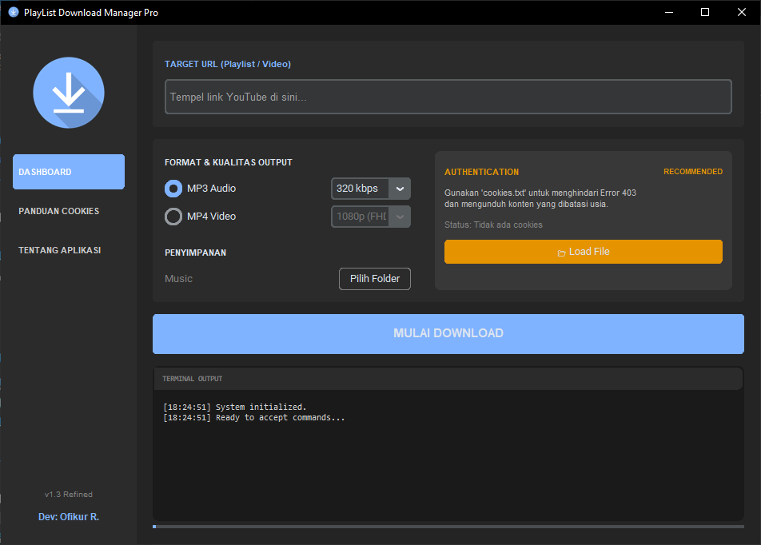

# 📥 PlayList Download Manager Pro

**PlayList Download Manager Pro** adalah aplikasi desktop portabel yang dirancang untuk memudahkan Anda mengunduh video maupun playlist penuh dari YouTube. Dengan antarmuka yang modern dan elegan, aplikasi ini siap digunakan tanpa perlu pengaturan sistem yang rumit.

---

## ✨ Fitur Utama

- 🚀 **All-in-One (Portable):** Tidak perlu menginstal Python atau mengatur FFmpeg secara manual. Semua engine sudah di-bundle di dalam satu file `.exe`. Tinggal klik dan jalankan!
- 🎬 **Kontrol Resolusi Video:** Unduh video MP4 dengan kualitas yang bisa Anda tentukan sendiri, mulai dari **360p, 720p, 1080p (FHD), 2K, hingga 4K (2160p)**.
- 🎵 **Kualitas Audio Premium:** Ubah video otomatis menjadi MP3 murni dengan pilihan bitrate tinggi: **128 kbps, 192 kbps, 256 kbps, hingga 320 kbps (HQ)**.
- 🍪 **Bypass Error 403 (Cookies Support):** Terintegrasi dengan fitur pembaca `cookies.txt` untuk mengunduh konten yang dibatasi usia (Age-Restricted) atau mencegah pemblokiran dari YouTube.
- 🖥️ **Terminal Log Terintegrasi:** Pantau proses unduhan secara *real-time* langsung dari antarmuka aplikasi.

---

## 🛠️ Cara Penggunaan (Instalasi)

Karena aplikasi ini bersifat **Portable**, Anda tidak perlu melakukan proses instalasi (Next > Next > Install).

1. Pergi ke halaman [**Releases**](https://github.com/ofikur/playlist-downloader-pro/releases/latest) di repository ini.
2. Download file bernama `PlaylistDownloader_Pro.exe`.
3. Simpan file tersebut di folder mana saja di komputer Anda (misal: Desktop atau folder khusus Download).
4. Klik dua kali (`double-click`) file tersebut untuk membuka aplikasi.
5. Tempel URL YouTube, pilih folder penyimpanan, atur kualitas, dan klik **Mulai Download**.

---

## 🍪 Solusi Jika Unduhan Gagal (Panduan Cookies)

YouTube sering kali menolak proses unduhan dari pihak ketiga yang memunculkan **Error 403 (Forbidden)** atau jika video dibatasi usia. Untuk mengatasinya, gunakan fitur **Authentication** di aplikasi ini:

1. Buka browser **Google Chrome** atau **Microsoft Edge**.
2. Cari dan instal ekstensi gratis bernama: **"Get cookies.txt LOCALLY"** dari Web Store.
3. Buka situs [YouTube](https://www.youtube.com) dan pastikan Anda sudah **Login** ke akun Google Anda.
4. Klik ikon ekstensi tersebut di pojok kanan atas browser Anda.
5. Klik tombol **Export** dan simpan file `cookies.txt` tersebut di komputer Anda.
6. Buka aplikasi **PlayList Download Manager Pro**, pada bagian *Authentication* klik tombol **Load File**.
7. Masukkan file `cookies.txt` yang baru saja Anda simpan.
8. Jalankan ulang proses download Anda. Dijamin 100% lancar!

---

## ⚠️ Disclaimer

Aplikasi ini dikembangkan murni untuk tujuan **edukasi dan penggunaan pribadi (Personal Use)**. Pengguna bertanggung jawab penuh atas hak cipta media yang diunduh menggunakan aplikasi ini. Pengembang tidak bertanggung jawab atas segala bentuk pelanggaran hak cipta atau distribusi ulang (pembajakan komersial) yang dilakukan oleh pengguna.

---

### 👨‍💻 Pengembang
Dikembangkan oleh: [**Ofikur R.**](https://github.com/ofikur)  
Engine Core: `yt-dlp` & `FFmpeg`  
UI Framework: `CustomTkinter`
